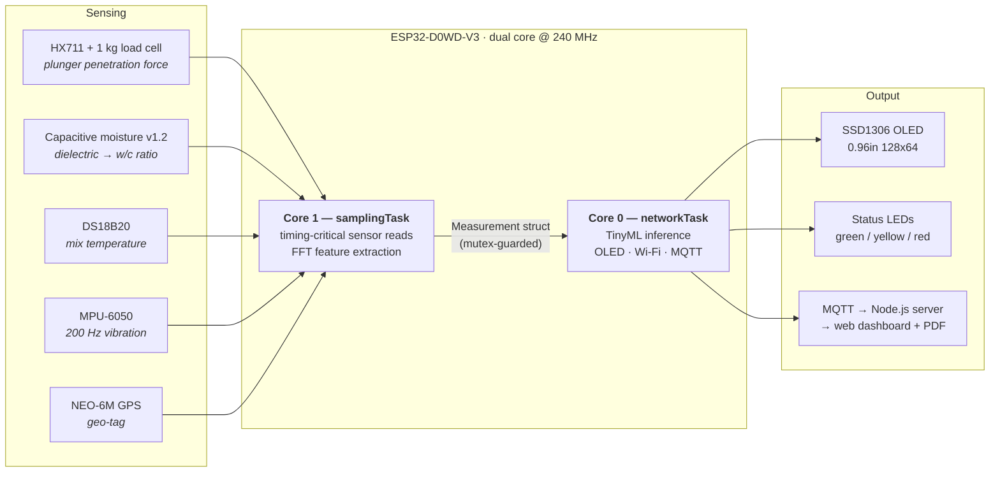
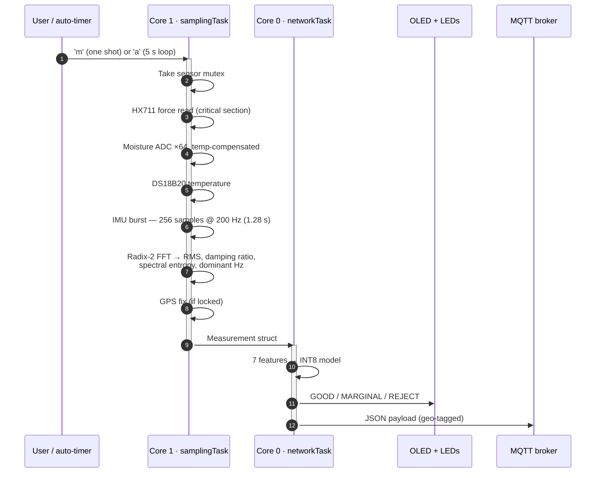
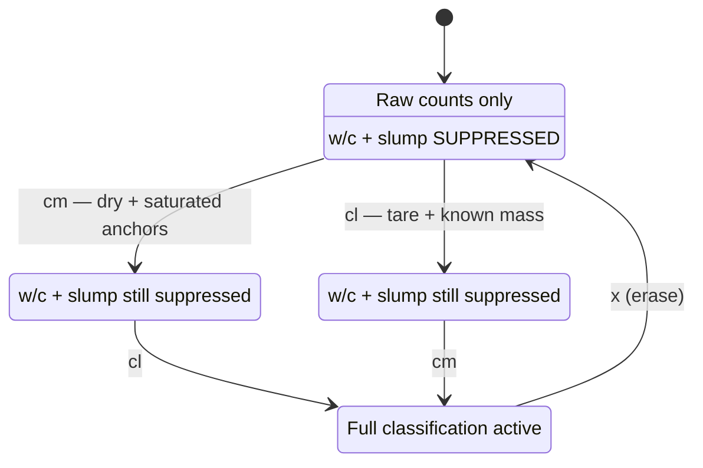
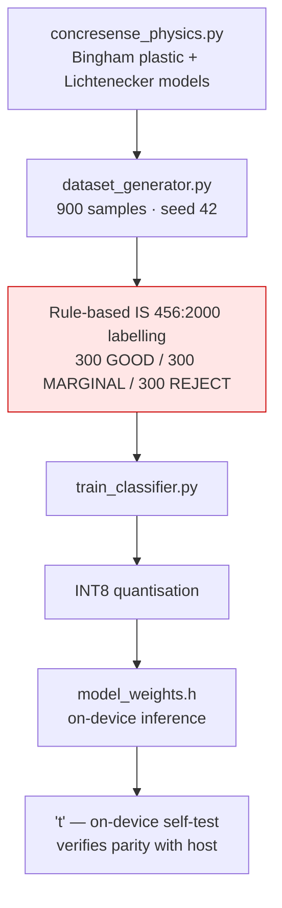
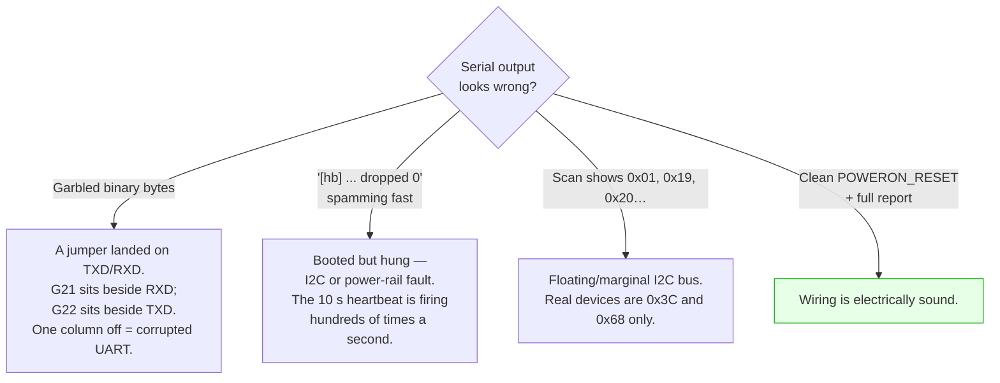

# ConcreSense

**On-site fresh-concrete quality screening on an ESP32 — in seconds, not 28 days.**

Concrete is normally accepted or rejected by crushing cured cube samples 28 days after the
pour. By then the structure is already built. ConcreSense is a handheld device that reads
the *fresh* mix at the point of pour, fuses four sensor streams, and classifies the batch
**GOOD / MARGINAL / REJECT** against IS 456:2000 limits using a TinyML model running
entirely on the microcontroller — no cloud round-trip required for the verdict.

> **Honest status:** the classifier is trained on a *physics-simulated* dataset. No real
> concrete has been tested. See [Model & honest metrics](#model--honest-metrics) before
> quoting any number from this repo.

---

## Table of contents

- [How it works](#how-it-works)
- [Measurement cycle](#measurement-cycle)
- [Hardware](#hardware)
- [Pinout](#pinout)
- [Repository layout](#repository-layout)
- [Build and flash](#build-and-flash)
- [Serial console](#serial-console)
- [Calibration (required)](#calibration-required)
- [Model & honest metrics](#model--honest-metrics)
- [Dashboard](#dashboard)
- [The physics](#the-physics)
- [Wiring gotchas](#wiring-gotchas)
- [Limitations](#limitations)

---

## How it works

Four sensors measure different physical properties of the wet mix. Their features feed an
INT8 quantised classifier on-device. The verdict is shown locally *and* published to a
cloud dashboard, geo-tagged.



### Why the cores are split this way

Arduino-ESP32 pins the Wi-Fi and TCP/IP stacks to **Core 0** and runs `loopTask` on
**Core 1**. So timing-critical work goes on Core 1, away from the radio:

- The HX711 read has a **60 µs** hard constraint — hold its clock high longer and the chip
  powers down mid-conversion. It is wrapped in a `portMUX` critical section.
- IMU sampling at 200 Hz cannot tolerate jitter from beacon frames and TCP retransmits.

This is deliberately the **reverse** of the original project spec, which assigned sensors to
Core 0. See [`AUDIT.md`](./AUDIT.md) §C for the full reasoning.

---

## Measurement cycle



A full cycle is dominated by the **1.28 s** IMU window. Auto-mode fires every 5 s — fresh
concrete properties change over minutes, so sampling faster would only heat the board and
flood the broker.

---

## Hardware

| Component | Role | Notes |
| :-- | :-- | :-- |
| ESP32 DevKit (38-pin) | MCU | ESP32-D0WD-V3, 4 MB flash, **no PSRAM** |
| HX711 + 1 kg load cell | Penetration force | Bit-banged 2-wire, no library |
| Capacitive soil moisture **v1.2** | w/c ratio proxy | **Not** the FC-28 — see below |
| DS18B20 | Temperature | Needs a **4.7 kΩ** pull-up to 3V3 |
| MPU-6050 (GY-521) | Vibration | I2C `0x68`, silkscreen order `VCC GND SCL SDA` |
| SSD1306 0.96" OLED | Display | I2C `0x3C` |
| NEO-6M | GPS geo-tag | UART2 @ 9600 baud |
| 3 × LED + 220 Ω | Status output | GOOD / MARGINAL / REJECT |

> ### ⚠️ Use the capacitive sensor, not the FC-28
> The FC-28 is the **resistive** two-prong module. It measures ionic conductivity, corrodes
> within minutes in cement pore solution, and is *not* described by the Lichtenecker
> dielectric model this project relies on. The capacitive v1.2 board is insulated and
> survives. This is documented in [`AUDIT.md`](./AUDIT.md) §B1.

> ### ⚠️ WROOM, not WROVER
> GPIO16/17 are only free for UART2 because this is a WROOM module. On a WROVER those pins
> belong to the PSRAM and **the GPS dies silently**.

---

## Pinout

All assignments live in [`firmware/concresense/src/config.h`](firmware/concresense/src/config.h) —
that file is the authority; wire from it, not from this table if they ever disagree.

| ESP32 pin | Connects to | Notes |
| :-- | :-- | :-- |
| `GPIO21` | OLED SDA + MPU-6050 SDA | shared I2C @ 400 kHz |
| `GPIO22` | OLED SCL + MPU-6050 SCL | shared I2C |
| `GPIO34` | Moisture AOUT | ADC1, input-only, **11 dB attenuation** |
| `GPIO18` | HX711 `DT` | |
| `GPIO19` | HX711 `SCK` | |
| `GPIO4` | DS18B20 `DQ` | + 4.7 kΩ pull-up to 3V3 |
| `GPIO16` | GPS **TX** | ESP32 receives |
| `GPIO17` | GPS **RX** | ESP32 transmits |
| `GPIO25` / `26` / `27` | Green / Yellow / Red LED | via 220 Ω |
| `3V3` / `GND` | Power rails | board has **no VIN** pin |

**11 dB attenuation matters:** the sensor swings ~1.0 V (wet) to ~3.0 V (dry). The ESP32's
default 0 dB attenuation saturates at ~1.1 V and would rail two-thirds of the useful range.

---

## Repository layout

```
firmware/concresense/        ESP32 firmware (Arduino / arduino-cli)
├── concresense.ino          setup, FreeRTOS tasks, serial console
└── src/
    ├── config.h             ← ALL pin assignments and tuning constants
    ├── sensors/             HX711, moisture, DS18B20, MPU-6050, NEO-6M drivers
    ├── features/            radix-2 FFT + spectral feature extraction
    ├── physics/             calibration anchors, NVS persistence
    ├── tinyml/              INT8 model weights, inference, on-device self-test
    ├── display/             SSD1306 driver
    └── network/             Wi-Fi + MQTT client
tinyml_model/                dataset generator, physics model, training script
dashboard/                   Node.js MQTT subscriber + web UI + PDF report
simulation/                  matplotlib animation of a full measurement run
wokwi/                       Wokwi simulator config (potentiometer stand-ins)
tools/                       host-side test harness, serial monitor
```

Key documents:

| File | What it is |
| :-- | :-- |
| [`PROJECT_ANALYSIS.md`](./PROJECT_ANALYSIS.md) | Architecture, hardware specs, research background |
| [`AUDIT.md`](./AUDIT.md) | **Corrections to the original spec + honesty constraints** |
| `PHASE_*_REPORT.md` | Build logs per development phase |

---

## Build and flash

Requires [`arduino-cli`](https://arduino.github.io/arduino-cli/) with the `esp32:esp32`
core. This project uses **arduino-cli, not PlatformIO**.

```bash
# Install libraries
arduino-cli lib install "Adafruit SSD1306" "Adafruit GFX Library" \
                        "DallasTemperature" "OneWire" \
                        "PubSubClient" "ArduinoJson"

# Compile
arduino-cli compile --fqbn esp32:esp32:esp32 --export-binaries firmware/concresense

# Flash
arduino-cli upload -p /dev/ttyUSB0 --fqbn esp32:esp32:esp32 firmware/concresense

# Watch
arduino-cli monitor -p /dev/ttyUSB0 -c baudrate=115200
```

Current footprint: **1,022,864 bytes flash (78%)**, **53,608 bytes RAM (16%)**.

### First boot

Every boot prints a bring-up report that probes all six subsystems independently. This is
the fastest way to find a wiring mistake — the firmware **degrades cleanly** rather than
hanging on a missing part.

```
--- I2C bus scan (SDA=21 SCL=22 @400kHz) ---
  0x3C  (SSD1306 OLED)
  0x68  (MPU-6050)
--- 2 device(s) ---

[1/6] SSD1306 OLED       ... OK
[2/6] Moisture (cap v1.2)... OK
[3/6] DS18B20 temp       ... ABSENT
...
```

`ABSENT` is expected for anything not yet wired; it will be picked up on the next boot.

---

## Serial console

Connect at **115200 baud**.

| Command | Action |
| :-- | :-- |
| `m` | Run one measurement cycle |
| `c` | Run measurement, print as CSV |
| `a` | Toggle the automatic 5 s loop |
| `cm` | **Calibrate moisture anchors** |
| `cl` | **Calibrate load cell** |
| `s` | Show calibration state |
| `x` | Erase stored calibration |
| `t` | On-device model self-test |
| `sim [n]` | Publish *n* simulated measurements |
| `wifi <ssid> <password>` | Set + persist Wi-Fi credentials |
| `mqtt <host> [port]` | Set + persist broker |
| `net` / `netclear` | Show / erase network config |
| `h` | Help |

**Credentials are set at runtime and stored in NVS — never commit them to source.**

---

## Calibration (required)

Raw sensor counts are meaningless until anchored to physical units. The firmware
*deliberately refuses* to report derived w/c ratio and slump until both calibrations are
done — an uncalibrated number that looks plausible is worse than no number.



Anchors persist in NVS via `Preferences`, so calibration survives a reboot.

---

## Model & honest metrics

The classifier is a small INT8-quantised model exported to C++ and run on-device.



### The numbers, stated honestly

| Metric | Value |
| :-- | :-- |
| Dataset | **900 synthetic**, **0 real** samples |
| Class balance | 300 / 300 / 300 |
| Cross-validated separability | **0.766 ± 0.041** |
| Held-out accuracy | **70.6%** (20% stratified split, chance = 33.3%) |
| `validated_against_real_concrete` | **`false`** |

**Read this before citing those figures.** The training labels were produced by applying
IS 456:2000 threshold rules to physics-simulated features. A model trained on rule-labelled
data trivially reproduces those rules, so this measures **separability of the synthetic
feature space** — it is *not* concrete-screening accuracy, and it says nothing about how the
device performs on a real pour. Every generated row carries `data_source=synthetic_physics`.

Top feature importances: penetration force (0.252), damping ratio (0.158), vibration RMS
(0.134), spectral entropy (0.127), moisture (0.126), temperature (0.117).

### Classification thresholds (IS 456:2000)

| Class | w/c ratio | Slump | Temperature |
| :-- | :-- | :-- | :-- |
| **GOOD** | 0.40 – 0.50 | 50 – 125 mm | < 35 °C |
| **MARGINAL** | 0.50 – 0.55 | 125 – 150 mm | 35 – 40 °C |
| **REJECT** | > 0.55 or < 0.35 | > 150 mm | > 40 °C |

Two gaps in the standard as written — w/c in `[0.35, 0.40)` and slump `< 50 mm` — match no
rule and would fall through to GOOD. Both are real workability defects, so the firmware and
the Python labeller **both** resolve them to `MARGINAL`, identically.

---

## Dashboard

```bash
cd dashboard/server
npm install
npm start        # MQTT subscriber + WebSocket streamer + REST API
npm run selftest
```

Subscribes to the device's MQTT topic, streams live readings over WebSocket to a Leaflet
map view, and generates PDF reports via `pdfkit`.

---

## The physics

**Water–cement ratio** — Lichtenecker's logarithmic mixing rule for the dielectric constant
of the mix:

$$\ln \varepsilon_{\text{mix}} = v_w \ln \varepsilon_w + v_c \ln \varepsilon_c + v_a \ln \varepsilon_a + v_{\text{air}} \ln \varepsilon_{\text{air}}$$

High ionic conductivity in fresh pore solution (Ca²⁺, OH⁻) is why the probe must be
insulated and capacitive, with polynomial ADC/temperature compensation.

**Slump / yield stress** — Bingham plastic model:

$$\tau = \tau_0 + \mu_p \dot{\gamma}$$

Plunger insertion force measured by the HX711 correlates logarithmically to yield stress,
with $\tau_0 \propto \text{slump}^{-1}$. Expected force range for 25–200 mm slump is roughly
**0.36 – 1.0 N** across a 5 mm-radius plunger.

**Vibration** — 256-sample bursts at 200 Hz through a radix-2 FFT (0.78 Hz bin width) yield
acceleration RMS, damping ratio, dominant frequency and spectral entropy.

---

## Wiring gotchas

Three mistakes that cost real debugging time on this build:



Two more worth knowing:

- **`3V3` is the only 3.3 V pin** on the 38-pin board (`GND` appears 3×), and it sits at a
  PCB corner where the mounting-hole overhang can block the adjacent breadboard hole. Its
  only neighbour is `EN` — a "3V3" wire that actually landed on `EN` boots fine with an
  empty rail, then resets the moment any module draws current through it.
- **Breadboard power rails are not bridged top-to-bottom by default.** If you bridge them,
  check the polarity runs straight across; a crossed bridge is a direct 3V3–GND short.

---

## Limitations

Stated plainly, because the project is a student build and the honest framing is the point:

1. **No real concrete has ever been tested.** Every metric in this repo describes simulated
   data.
2. **The labels are rules, not ground truth.** Reported separability partly measures the
   model's ability to re-learn thresholds it was trained on.
3. **The moisture → w/c mapping is uncalibrated against lab-verified mixes.** It relies on a
   dielectric model with assumed constants.
4. **GPS gets no fix indoors** — published as such rather than faked.
5. `AUDIT.md` §D documents several claims from the original project spec that could not be
   substantiated, including an unsupported R² statistic and unverifiable citations.

---

## Author

**Anbuchelvan** · CSE A · 24CS0059
